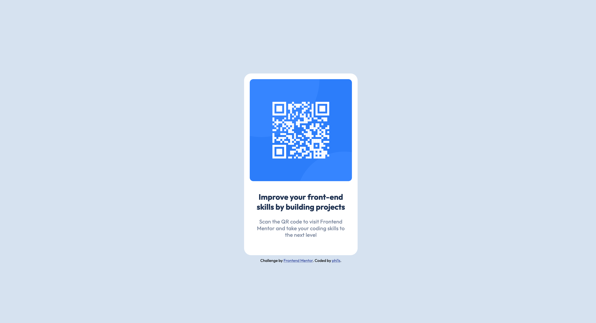

# Frontend Mentor - QR code component solution

This is a solution to the [QR code component challenge on Frontend Mentor](https://www.frontendmentor.io/challenges/qr-code-component-iux_sIO_H). Frontend Mentor challenges help you improve your coding skills by building realistic projects.

## Table of contents

- [Overview](#overview)
  - [Screenshot](#screenshot)
  - [Links](#links)
- [My process](#my-process)
  - [Built with](#built-with)
  - [What I learned](#what-i-learned)
- [Author](#author)
- [Acknowledgments](#acknowledgments)

## Overview

### Screenshot

### Links

- Solution URL: [https://github.com/phi1s/qr-code-component](https://github.com/phi1s/qr-code-component)
- Live Site URL: [https://clinquant-sprite-326f40.netlify.app/](https://clinquant-sprite-326f40.netlify.app/)

## My process

### Built with

- Semantic HTML5 markup
- CSS custom properties

### What I learned

During this project I learned:

- how to solve a frontend mentor challenge;)
- the basics of html/css
- how to deploy a website using netlify

## Author

- Github - [phi1s](https://github.com/phi1s)
- Frontend Mentor - [@phi1s](https://www.frontendmentor.io/profile/phi1s)

## Acknowledgments

Thanks a lot to [Frontend Mentor](https://www.frontendmentor.io/) for their great platform and community. It is incredibly motivating and rewarding to learn in such an environment.
